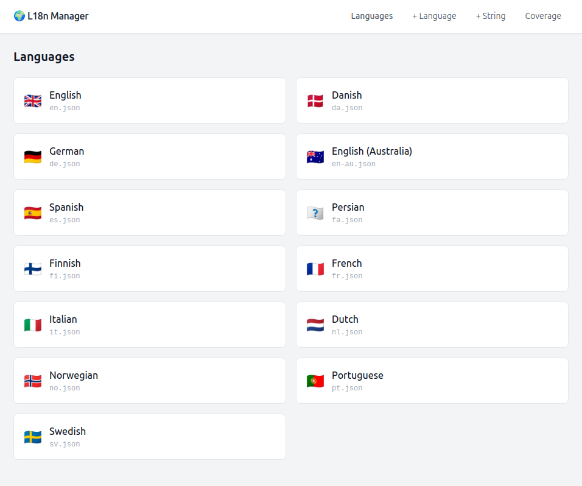
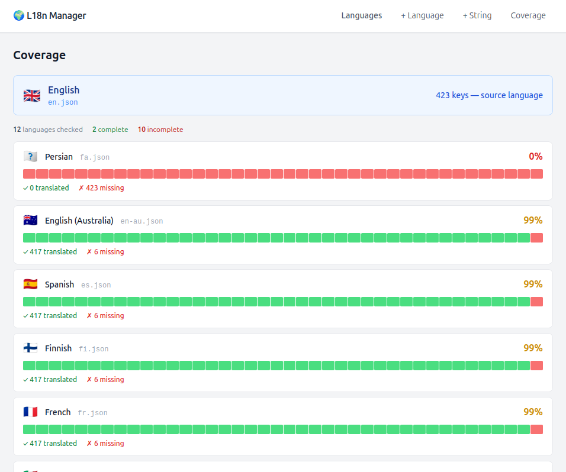
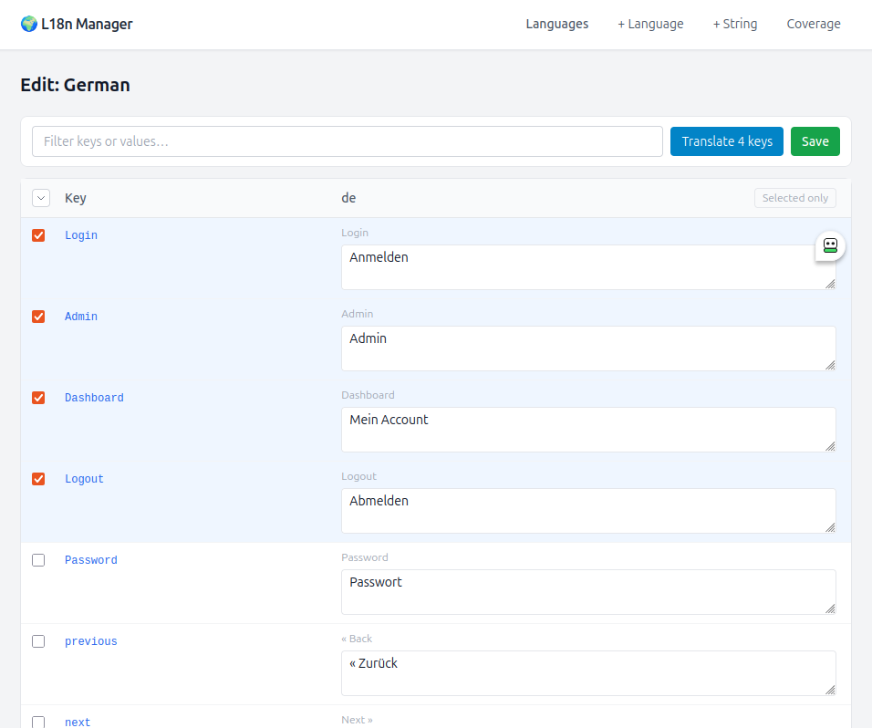
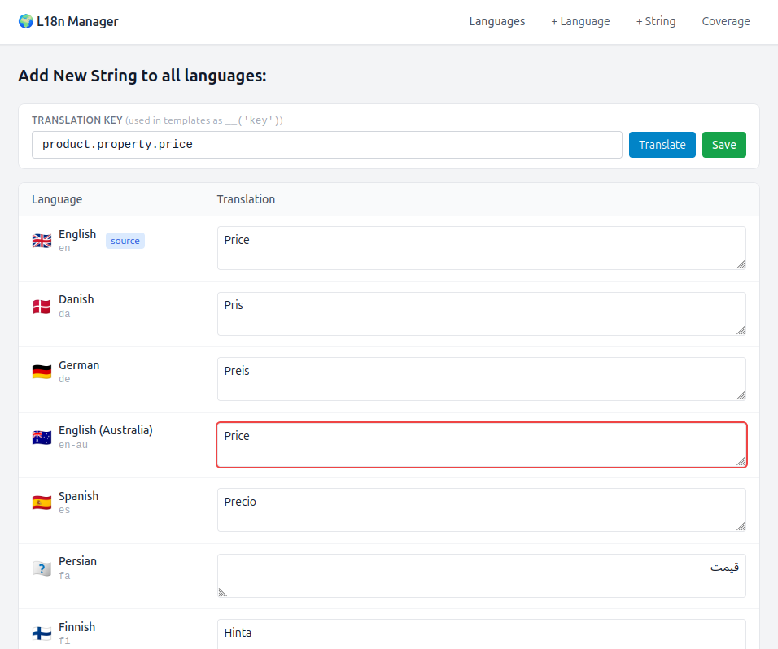
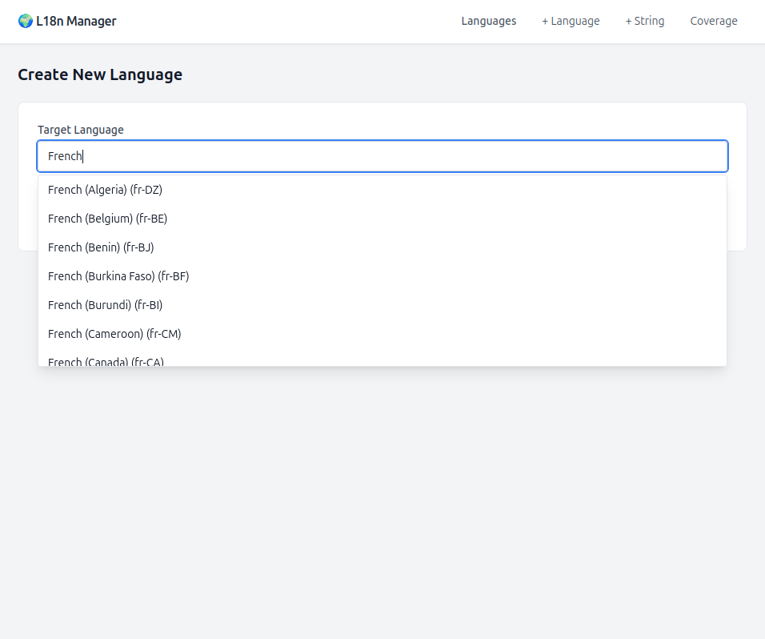

# Laravel L18n Translator

A backend package for multi-language Laravel projects. It mounts a translation editor directly inside your app - no separate tools, no file juggling between folders and services, no format conversions, no broken or invalid `.json` files. Your `resources/lang/*.json` files are edited in the browser, can be automatically betch-translated via Deepl and saved directly back to disk, ready to be used use in your app.

Install it in any Laravel project that already uses Localization and JSON language files (see https://laravel.com/docs/13.x/localization) and needs a maintainable way to keep translations up to date. It is especially useful when multiple languages are added over time and keeping all translation keys in sync across files becomes error-prone.

Optional [DeepL](https://www.deepl.com) auto-translation included. The UI is built with Tailwind CSS and Alpine.js, loaded from CDN — no build step required.

---

## Screenshots

### Language overview

All installed language files at a glance, with flag emoji and locale name resolved automatically from the ICU library. Click any language to open its editor.



### Coverage dashboard

Shows translation completeness for every language at a glance. Each card displays a block strip (green = translated, red = missing), the exact counts for translated, missing, and orphaned keys, and the percentage complete. Click a card to open the editor pre-filtered to missing keys only.



### Per-language editor

Side-by-side view of the source language and the translation. Filter by key or value in real time, switch to missing-only mode to focus on untranslated strings, and use DeepL to batch-translate selected keys in one click. Orphaned keys (present in the translation but removed from the source) are listed at the bottom with an option to adopt them back into the source language.



### Edit a single key across all languages

Search for a key and edit its value in every language file on one screen. Useful for fixing a typo or updating a string without having to switch between language editors. DeepL can translate from the source language for each target with one click.



### Create a new language

Searchable picker covering every locale known to the ICU library. Selecting a locale creates a new `.json` file pre-filled with all keys from the source language, ready to translate.



---

## Features

- **Language overview:** list all `resources/lang/*.json` files with flag emoji and locale name
- **Per-language editor:** side-by-side view of source vs. target language with inline editing
- **Search & filter:** filter rows by key or value in real time
- **Missing-only mode:** show only untranslated keys with one click (or via `?filter=missing` URL param)
- **Coverage dashboard:** visual block display showing translation completeness across all languages at a glance
- **Orphaned key detection:** highlights keys present in a translation file but missing in the source language, with one-click adoption
- **Add / edit a single key:** edit one key across every language file simultaneously
- **DeepL auto-translation:** batch-translate selected missing strings via DeepL (optional; hidden when no key is configured)
- **RTL support:** right-to-left text direction applied automatically for Arabic, Hebrew, Persian, and other RTL locales
- **No hardcoded language lists:** available locales, display names, and RTL detection all come from PHP's `ext-intl` extension (backed by the [ICU library](https://icu.unicode.org)), so every locale ICU knows about is supported out of the box

---

## Requirements

- PHP 8.1+
- Laravel 10, 11, or 12
- `ext-intl` (for locale name resolution and flag detection)

---

## Installation

```bash
composer require dwoydig/l18n-translator
```

Laravel auto-discovers the service provider. No manual registration needed.

### Publish the config (optional)

```bash
php artisan vendor:publish --tag=l18n-translator-config
```

This creates `config/l18n-translator.php`.

---

## Configuration

```php
// config/l18n-translator.php

return [
    'route_prefix'  => 'admin/translations', // URL prefix for all routes
    'middleware'    => ['web', 'auth'],       // protect the UI
    'main_language' => 'en',                 // source language all others are translated from

    // null   = use built-in layout (Tailwind + Alpine CDN)
    // string = your own layout, e.g. 'layouts.admin'
    //          must @yield('content') and @yield('scripts')
    'layout' => null,

    'deepl' => [
        'enabled'     => (bool) env('DEEPL_AUTH_KEY'),
        'auth_key'    => env('DEEPL_AUTH_KEY'),
        'endpoint'    => env('DEEPL_ENDPOINT', 'https://api.deepl.com/v2/translate'),
        'formality'   => 'prefer_less', // prefer_less | prefer_more | default
        'context'     => '',            // optional global translation context hint
        'concurrency' => 5,             // parallel DeepL requests per batch
    ],

    // Overrides for ISO codes that differ from DeepL's target_lang codes.
    // Most languages work automatically (e.g. "de" → "DE").
    // Only add entries where DeepL deviates from the ISO code.
    'deepl_lang_map' => [
        'no' => 'NB',     // DeepL uses NB (Bokmål), not NO
        'pt' => 'PT-PT',  // DeepL distinguishes PT-PT / PT-BR
    ],
];
```

### DeepL auto-translation

Get your API key from the [DeepL developer portal](https://developers.deepl.com/docs/getting-started/quickstart), then add it to your `.env` file.

```env
DEEPL_AUTH_KEY=your-deepl-auth-key
```

The free plan covers most use cases. After adding a key, the "Translate N keys" button becomes available in the editor. Without a key the UI works normally, only the translate button is hidden.

There are no plans to add other translation services like Amazon Translate. I have worked with them before and found the translation quality to be poor. Use DeepL if you care about quality and your conversion rate.

---

## Usage

Navigate to `/admin/translations` (or your configured `route_prefix`).

| Screen | What you can do                                                                         |
|---|-----------------------------------------------------------------------------------------|
| **Languages** | Overview of all language files in your laravel lang folder                              |
| **Coverage** | Visual block display of translation completeness per language                           |
| **Edit language** | Editor with search, missing-only filter, orphan detection, and DeepL batch-translate    |
| **+ Language** | Creates a new `{lang}.json` pre-filled with all required keys from the source language |
| **+ String** | Add a new string to all language files at once                                          |
| **Edit string** | Edit one key across all languages         |

### Coverage screen

The coverage screen (`/admin/translations/coverage`) shows a card per language with a block strip indicating how complete the translation is. Green blocks for translated keys, red for missing.

Clicking a language card opens the editor pre-filtered to missing keys only.

### Orphaned keys

When a translation file contains keys that no longer exist in the source language, they are listed at the bottom of the editor. You can select and adopt them into the source language with one click.

---

## Customising the views

Publish the Blade views to `resources/views/vendor/l18n-translator/`:

```bash
php artisan vendor:publish --tag=l18n-translator-views
```

Edit them freely. Published views take precedence over the package's built-in ones.

If you use a custom `layout`, set it in the config:

```php
'layout' => 'layouts.admin',
```

Your layout must include `@yield('content')` and `@yield('scripts')`.

---

## Routes

All routes are prefixed with `route_prefix` (default `admin/translations`) and named with the `l18n.` prefix:

| Name | Method | URL |
|---|---|---|
| `l18n.index` | GET | `/admin/translations` |
| `l18n.coverage` | GET | `/admin/translations/coverage` |
| `l18n.create` | GET | `/admin/translations/create` |
| `l18n.addstring` | GET | `/admin/translations/addstring` |
| `l18n.editstrings` | GET | `/admin/translations/editstrings?key={key}` |
| `l18n.show` | GET | `/admin/translations/{lang}` |
| `l18n.store` | POST | `/admin/translations/store` |
| `l18n.storedictionary` | POST | `/admin/translations/storedictionary` |
| `l18n.appendtotranslation` | POST | `/admin/translations/appendtotranslation` |
| `l18n.updatealltranslations` | POST | `/admin/translations/updatealltranslations` |
| `l18n.orphans.adopt` | POST | `/admin/translations/orphans/adopt` |
| `l18n.deepl` | POST | `/admin/translations/deepl` |

---

## License

MIT
